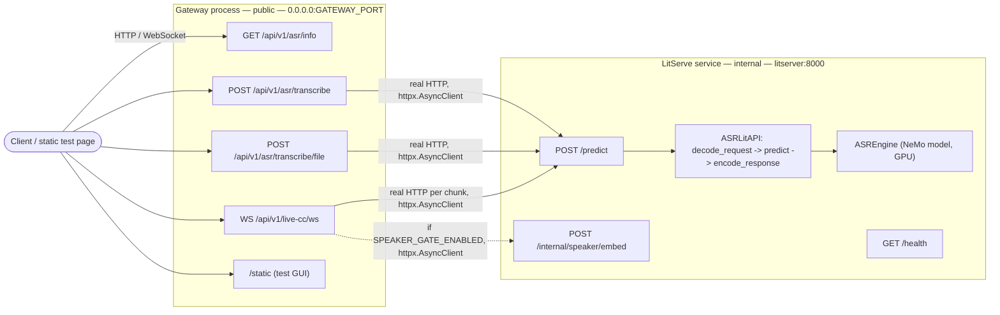

# ASR Inference Pipeline

[](pyproject.toml)
[](https://fastapi.tiangolo.com/)
[](https://github.com/Lightning-AI/LitServe)
[](docker-compose.yml)
[](https://github.com/NVIDIA/NeMo)
[](#current-model)

Bengali ASR (automatic speech recognition): a NeMo Conformer-CTC model served with [LitServe](https://github.com/Lightning-AI/LitServe), fronted by a FastAPI gateway.

- One-shot file transcription and streamed live captions over WebSocket
- Benchmark tool for WER/CER against labeled ground truth

<p align="center">
  <a href="#current-model">Model</a> ·
  <a href="#architecture">Architecture</a> ·
  <a href="#structure">Structure</a> ·
  <a href="#setup">Setup</a> ·
  <a href="#docker">Docker</a> ·
  <a href="#test">Test</a> ·
  <a href="#endpoints">Endpoints</a> ·
  <a href="#config">Config</a> ·
  <a href="#client-examples">Client examples</a> ·
  <a href="#evaluating-against-ground-truth">Evaluation</a>
</p>

---

## Current Model

- **Checkpoint:** [`titu_stt_bn_conformer_large`](https://huggingface.co/hishab/titu_stt_bn_conformer_large) — pulled from Hugging Face at load time, not hosted by this project
- **Architecture:** [Conformer](https://arxiv.org/abs/2005.08100) (Gulati et al., 2020) — CTC decoding, fine-tuned for Bengali (`bn`)
- **Input:** 16 kHz mono (`SAMPLE_RATE`)
- **License:** CC-BY-NC-4.0 (non-commercial)
- **Swap it:** set `MODEL_NAME` (see [Config](#config)) to the smaller, faster [`titu_stt_bn_fastconformer`](https://huggingface.co/hishab/titu_stt_bn_fastconformer) checkpoint, same family — lower accuracy but higher throughput (see `outputs/benchmark_report.pdf`). `GET /api/v1/asr/info` reports whichever one is actually loaded.

**Inference notes**

- Runs `fp16` on GPU — roughly doubles throughput, negligible accuracy impact. CPU stays `fp32` (no efficient fp16 kernel path).
- Audio over `MAX_SEGMENT_SECONDS` (18s default) is split into non-overlapping segments and rejoined — this checkpoint trained on clips up to ~18.5s; longer inputs blow up the encoder's attention memory.

---

## Architecture

Two independent services, separate processes and containers:

| Service | File | Role |
|---|---|---|
| **LitServe model server** | `run_litserve.py` | Holds the model, GPU-bound. Binds `0.0.0.0:8000` internally. |
| **Gateway** | `main.py` | Pure FastAPI, no model loaded. Public entrypoint, binds `0.0.0.0:GATEWAY_PORT` (default `8000`). Reaches LitServe over real HTTP at a fixed `litserver:8000`. |

`litserver` resolves via Docker Compose's internal DNS (`asr-net` network), and `gateway` waits on `litserver`'s healthcheck before starting.



<details>
<summary><code>/predict</code> is internal-only — details</summary>

`POST /predict` (LitServe's own raw JSON inference route) only runs on the internal LitServe port; it is not proxied through the gateway. Externally, use `POST /api/v1/asr/transcribe` (raw base64 JSON) or `POST /api/v1/asr/transcribe/file` (multipart upload) — the gateway forwards either to `/predict` for you. Need raw base64-JSON access from outside the container? Either open the internal port at your own risk or add a passthrough route to the gateway.

</details>

---

## Structure

```
.
├── main.py                        # entrypoint — gateway service (pure FastAPI, no model)
├── run_litserve.py                # entrypoint — LitServe model server service
├── fastapi.Dockerfile              # lightweight image for the gateway (no torch/nemo)
├── litserver.Dockerfile            # heavy image for the LitServe model server (GPU, torch/nemo)
├── src/
│   ├── core/
│   │   ├── config.py              # env-driven settings (no prefix)
│   │   └── logging.py             # loguru sinks
│   ├── litserver/
│   │   ├── engine.py              # NeMo model load + transcribe
│   │   ├── litapi.py              # LitServe API: setup/decode/predict/encode
│   │   ├── speaker.py             # Resemblyzer voice-embedding wrapper
│   │   └── server.py              # builds the LitServer instance
│   ├── utils/
│   │   ├── audio.py               # base64 -> waveform decode/resample
│   │   └── metrics.py             # cosine_similarity (speaker-gate comparisons)
│   └── api/
│       ├── client.py              # gateway -> LitServe HTTP client (shared by asr/live_cc routers)
│       ├── speaker/router.py      # internal /internal/speaker/embed route (mounted on LitServe)
│       ├── speaker/schema.py      # request model
│       └── v1/
│           ├── asr/router.py      # /api/v1/asr/* routes (gateway; proxies to LitServe over HTTP)
│           ├── asr/schema.py      # request/response models
│           └── live_cc/router.py  # /api/v1/live-cc/ws (gateway; proxies to LitServe over HTTP)
├── static/index.html              # manual test page
├── tests/test_api.py              # unit tests (model mocked)
├── examples/client_example.py     # minimal Python client
└── scripts/
    ├── benchmark.py                # WER/CER + latency eval against ground truth (requires it)
    └── download_eval_data.py       # fetch a small labeled Bengali ASR benchmark (ground truth)
```

---

## Setup

```bash
python -m venv .venv && source .venv/bin/activate
pip install -e .
cp .env.example .env
```

- `pip install -e .` alone installs only the gateway's dependencies (fastapi/httpx/uvicorn — no torch/nemo).
- To also run the model server locally, install the `serve` extra: `pip install -e ".[serve]"` — `nemo_toolkit[asr]` is heavy (several minutes, several GB).
- **Python version:** fixed at 3.12 (`requires-python = "==3.12.*"`) across both services — the gateway image (`python:3.12-slim`) and the LitServe/GPU image (`pytorch/pytorch:2.10.0-cuda13.0-cudnn9-runtime`, the first PyTorch release to ship Python 3.12).

---

## Docker

```bash
docker compose up --build
```

Two separate images, from two separate Dockerfiles:

| Image | Dockerfile | Notes |
|---|---|---|
| `litserver` | `litserver.Dockerfile` | CUDA/PyTorch base, GPU-bound, several GB |
| `gateway` | `fastapi.Dockerfile` | `python:3.12-slim`, no ML deps — small, fast to build/deploy/scale independently |

- `gateway` won't accept traffic until `litserver`'s healthcheck (`GET /health`) passes — no manual readiness polling needed. First request otherwise pays the checkpoint download (cached under `$HF_HOME` / `~/.cache/huggingface`).
- Test page: `http://localhost:8000/static/index.html`
- GPU is on by default (`ACCELERATOR=cuda`, requires `nvidia-container-toolkit`). For CPU-only: remove the `deploy.resources` block from `litserver` in `docker-compose.yml` and set `ACCELERATOR=cpu`.

---

## Test

```bash
pip install -e ".[dev,serve]"
pytest -q
```

`serve` is required alongside `dev` because the tests exercise `ASREngine`/`ASRLitAPI` directly (model mocked), which import `torch`/`numpy`.

---

## Endpoints

| | |
|---|---|
| `POST /api/v1/asr/transcribe` | raw base64 JSON, forwarded straight to `/predict` (gateway, public) |
| `POST /api/v1/asr/transcribe/file` | multipart file upload (gateway, public) |
| `WS /api/v1/live-cc/ws` | streamed captions, raw 16-bit PCM (gateway, public) |
| `GET /api/v1/asr/info` | model metadata: Hugging Face model name, language, sample rate (gateway, public) |
| `GET /health` | LitServe healthcheck (internal) |
| `GET /docs` | Swagger UI (gateway) — WebSocket routes never appear here |
| `POST /predict` | raw JSON inference — **internal LitServe only** |
| `POST /internal/speaker/embed` | speaker-embedding for the live-cc speaker gate — **internal LitServe only** |

<details>
<summary>Inference request / response payloads</summary>

Request (internal `/predict`, and what `/api/v1/asr/transcribe/file` builds internally):

```json
{
  "config": {
    "language": {"sourceLanguage": "bn"},
    "samplingRate": 16000
  },
  "audio": [
    {"audioContent": "<base64-encoded wav/flac/ogg/mp3>"}
  ]
}
```

Response:

```json
{
  "taskType": "asr",
  "output": [{"source": "transcribed bengali text"}],
  "time_taken": 0.42
}
```

live-cc WebSocket messages:

```json
{"text": "in-progress guess so far", "is_final": false}
{"text": "committed bengali text", "is_final": true}
```

</details>

<details>
<summary>Speaker gate (optional, off by default)</summary>

For live-cc calls where background talkers near the caller's mic shouldn't be transcribed (single mic, no hardware control — e.g. a voice call bot). When `SPEAKER_GATE_ENABLED=true`:

1. The first `SPEAKER_ENROLL_SECONDS` of the call enroll a reference voice embedding (via LitServe's internal `/internal/speaker/embed`, backed by [Resemblyzer](https://github.com/resemble-ai/Resemblyzer)) — assumes the target caller speaks first; a background voice speaking first enrolls the wrong speaker.
2. Every chunk after that is embedded and compared to the enrollment; chunks below `SPEAKER_SIMILARITY_THRESHOLD` cosine similarity are dropped — no caption emitted at all for that chunk.

This is **segment-level gating only** — it can't separate two people talking *simultaneously* within one chunk (that needs real source separation). `SPEAKER_SIMILARITY_THRESHOLD=0.75` is a generic starting point from speaker-verification literature, not measured against this project's own calls — tune it against real recordings before trusting it in production.

Requires the `speaker` extra: `pip install ".[serve,speaker]"` (already included in `litserver.Dockerfile`).

</details>

---

## Config

All settings are plain env vars (no prefix). See `.env.example` for the full list and defaults.

- `DEVICES` / `WORKERS_PER_DEVICE` — GPU worker process count, the actual concurrency lever for inference throughput (see `src/core/config.py` for memory-tradeoff notes).
- `GATEWAY_PORT` — public gateway port (always binds `0.0.0.0`); the only network setting that's actually configurable. Gateway always reaches LitServe at fixed `litserver:8000`.
- `SPEAKER_GATE_ENABLED` / `SPEAKER_ENROLL_SECONDS` / `SPEAKER_SIMILARITY_THRESHOLD` — optional live-cc speaker gate, see "Speaker gate" under [Endpoints](#endpoints) above.

---

## Client examples

```bash
python examples/client_example.py path/to/audio.wav
```

> Currently POSTs to `/predict`, not a real route on this service — broken until updated to target `/api/v1/asr/transcribe/file` (or the internal `/predict` if run against the LitServe port directly).

---

## Evaluating against ground truth

`scripts/benchmark.py` computes WER/CER for any ASR HTTP endpoint sharing this pipeline's request/response contract, measured against labeled ground truth.

```bash
pip install ".[eval]"
python scripts/download_eval_data.py --data-dir data/eval_fleurs_bn
python scripts/benchmark.py --api-url http://127.0.0.1:8000/predict \
    --data-dir data/eval_fleurs_bn --output-dir benchmark_output
```

Writes two files to `--output-dir`:

- `predictions.json` — per-utterance reference, hypothesis, WER/CER, latency, any request error.
- `report.txt` — corpus-level WER/CER/MER/WIL (aggregated, not averaged) and latency stats.

<details>
<summary>Evaluation dataset details</summary>

[FLEURS](https://huggingface.co/datasets/google/fleurs) (Google's multilingual speech benchmark, 100+ languages) — read-aloud, professionally recorded sentences from the FLoRes machine-translation dataset, so content is naturally-worded but not spontaneous/conversational. This project uses the `bn_in` (Bengali, India locale) config, license CC-BY-4.0.

`download_eval_data.py` pulls the `test` (920 utterances) and `validation` (402 utterances) splits via the `datasets` library — not `train`, which isn't held-out eval data. Audio is 16 kHz mono, 32-bit float WAV, a few seconds to ~15s long, each with a `transcription` (normalized) and `raw_transcription` (original casing/punctuation).

Output layout in `--data-dir`:

- `data.tar` — one archive member per utterance (`fleurs_bn_{split}_{position:04d}.wav`). `benchmark.py` reads audio straight out of it via `tarfile`, no extraction step.
- `ground_truth.json` — tar member name → `{transcription, raw_transcription}`, merged across both splits.

Member names are the loop position, not FLEURS' own `id` field — `id` is **not unique within a split** (`validation` has 402 rows but only 150 distinct ids, which would silently overwrite 252 files if used as the filename).

</details>
