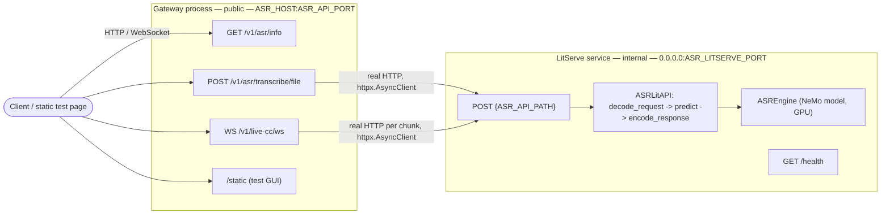

# Bangla ASR Pipeline

Bengali speech-to-text service. Model: [hishab/titu_stt_bn_fastconformer](https://huggingface.co/hishab/titu_stt_bn_fastconformer) (NeMo FastConformer-CTC). Served with [LitServe](https://github.com/Lightning-AI/LitServe).

## Architecture

Two independent services, split by concern — separate processes, separate containers in Docker:

- **LitServe model server** (`run_litserve.py`, built from `src/litserver/`) — holds the model, GPU-bound. Always binds `0.0.0.0:ASR_LITSERVE_PORT` inside its own process/container; not meant to be reached by anything other than the gateway.
- **Gateway** (`main.py`) — pure FastAPI, no model loaded in-process. This is the public entrypoint (`ASR_HOST:ASR_API_PORT`, `0.0.0.0:8000` by default). It reaches the LitServe server over a real HTTP call (`httpx.AsyncClient`) at `ASR_LITSERVE_HOST:ASR_LITSERVE_PORT` — `ASR_LITSERVE_HOST` is just the gateway's *connect* target: `127.0.0.1` for two local processes on one machine, or the Docker Compose service name (`litserver`) when they're separate containers.

Run them as two separate commands — there is no single entrypoint that starts both:

```bash
python run_litserve.py   # terminal 1 — model server
python main.py           # terminal 2 — gateway
```

In Docker Compose, the `gateway` service waits on the `litserver` service's healthcheck before starting (model load can take a while on first run — see `docker-compose.yml`).



**Note:** `POST {ASR_API_PATH}` (the raw JSON inference endpoint LitServe itself exposes) only runs on the internal LitServe port — it is not proxied through the gateway. Externally, use `POST /v1/asr/transcribe/file` (multipart upload) instead; the gateway forwards that to the internal endpoint for you. If you need raw base64-JSON access from outside the container, either open the internal port at your own risk or add a passthrough route to the gateway.

## Structure

```
.
├── main.py                        # entrypoint — gateway service (pure FastAPI, no model)
├── run_litserve.py                # entrypoint — LitServe model server service
├── fastapi.Dockerfile              # lightweight image for the gateway (no torch/nemo)
├── litserver.Dockerfile            # heavy image for the LitServe model server (GPU, torch/nemo)
├── src/
│   ├── core/
│   │   ├── config.py              # env-driven settings (ASR_*)
│   │   └── logging.py             # loguru sinks
│   ├── litserver/
│   │   ├── engine.py              # NeMo model load + transcribe
│   │   ├── litapi.py              # LitServe API: setup/decode/predict/encode
│   │   └── server.py              # builds the LitServer instance
│   ├── utils/
│   │   └── audio.py               # base64 -> waveform decode/resample
│   └── api/v1/
│       ├── asr/router.py          # /v1/asr/* routes (gateway; proxies to LitServe over HTTP)
│       ├── asr/schema.py          # request/response models
│       └── live_cc/router.py      # /v1/live-cc/ws (gateway; proxies to LitServe over HTTP)
├── static/index.html              # manual test page
├── tests/test_api.py              # unit tests (model mocked)
├── examples/client_example.py     # minimal Python client
└── benchmark.py                   # latency/quality comparison script
```

## Setup

```bash
python -m venv .venv && source .venv/bin/activate
pip install -e .
cp .env.example .env
```

Model license: **CC-BY-NC-4.0** (non-commercial). `nemo_toolkit[asr]` is a heavy install — several minutes, several GB. `pip install -e .` alone gets you the gateway's dependencies only (fastapi/httpx/uvicorn — no torch/nemo). To also run the model server locally, install the `serve` extra: `pip install -e ".[serve]"`.

## Run

```bash
python run_litserve.py   # terminal 1
python main.py           # terminal 2
```

First request downloads the checkpoint (cached under `$HF_HOME` / `~/.cache/huggingface`) — slow once, fast after. The gateway will return connection errors for `/v1/asr/transcribe/file` and `/v1/live-cc/ws` until `run_litserve.py` has finished loading the model — there's no readiness wait outside of Docker Compose (see below), so give it a moment on first run.

Test page: `http://localhost:8000/static/index.html`

## Docker

```bash
docker compose up --build
```

Two separate images, built from two separate Dockerfiles:

- `litserver` — built from `litserver.Dockerfile` (CUDA/PyTorch base, `torch`/`nemo_toolkit`/`litserve` installed via the `serve` extra). GPU-bound, several GB.
- `gateway` — built from `fastapi.Dockerfile` (`python:3.12-slim`, base dependencies only — no ML deps at all). Small, fast to build/deploy/scale independently of the model image.

`gateway` won't start accepting traffic until `litserver`'s healthcheck passes (`GET /health`), which covers the model-load wait automatically — no manual readiness polling needed.

GPU is on by default (`ASR_ACCELERATOR=cuda`, requires `nvidia-container-toolkit`). For CPU-only, remove the `deploy.resources` block from the `litserver` service in `docker-compose.yml` and set `ASR_ACCELERATOR=cpu`.

## Test

```bash
pip install -e ".[dev,serve]"
pytest -q
```

`serve` is required alongside `dev` because the tests exercise `ASREngine`/`ASRLitAPI` directly (with the model mocked), which import `torch`/`numpy`.

## Endpoints

| | |
|---|---|
| `POST /v1/asr/transcribe/file` | multipart file upload (gateway, public) |
| `WS /v1/live-cc/ws` | streamed captions, raw 16-bit PCM (gateway, public) |
| `GET /v1/asr/info` | model metadata (gateway, public) |
| `GET /health` | LitServe healthcheck (internal) |
| `GET /docs` | Swagger UI (gateway) — WebSocket routes never appear here, OpenAPI has no way to describe them |
| `POST {ASR_API_PATH}` | raw JSON inference — **internal LitServe only**, not exposed on the gateway |

`ASR_API_PATH` defaults to `/api/v1/asr/transcribe` — check `.env` / `.env.example`, not this file, for the current value.

### Inference request (internal `{ASR_API_PATH}`, and what `/v1/asr/transcribe/file` builds internally)

```json
{
  "config": {
    "language": {"sourceLanguage": "bn"},
    "samplingRate": 16000
  },
  "audio": [
    {"audioContent": "<base64-encoded wav/flac/ogg/mp3>"}
  ]
}
```

### Response

```json
{
  "taskType": "asr",
  "output": [{"source": "transcribed bengali text"}],
  "time_taken": 0.42
}
```

### live-cc messages

```json
{"text": "in-progress guess so far", "is_final": false}
{"text": "committed bengali text", "is_final": true}
```

## Config

All settings are env vars prefixed `ASR_`. See `.env.example` for the full list and defaults. Key ones beyond the model itself:

- `ASR_DEVICES` / `ASR_WORKERS_PER_DEVICE` — GPU worker process count; the actual concurrency lever for inference throughput (see `src/core/config.py` for the memory-tradeoff notes).
- `ASR_HOST` / `ASR_API_PORT` — public gateway address.
- `ASR_LITSERVE_HOST` / `ASR_LITSERVE_PORT` — where the gateway reaches the LitServe service: `127.0.0.1` for two local processes on one host (default), or the Compose service name (`litserver`) when they're separate containers. LitServe itself always binds `0.0.0.0` regardless of this setting.

## Client examples

```bash
python examples/client_example.py path/to/audio.wav
python benchmark.py --data-dir data
```

Both currently POST to `/predict`, not a real route on this service (public or internal) — broken until updated to target `/v1/asr/transcribe/file` (or the internal `{ASR_API_PATH}` if run against the LitServe port directly).
