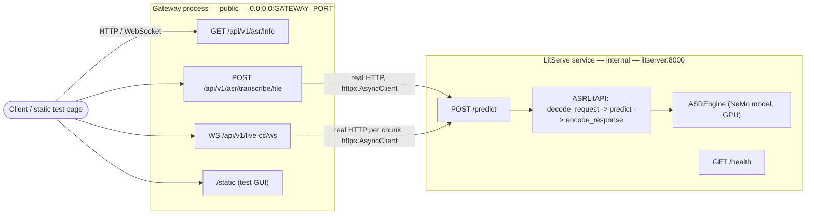

# Bangla ASR Pipeline

A Bengali ASR (automatic speech recognition) pipeline: a NeMo Conformer-CTC model served with [LitServe](https://github.com/Lightning-AI/LitServe), fronted by a FastAPI gateway. Supports both one-shot file transcription and streamed live captions over WebSocket, and ships with a benchmark tool for measuring accuracy (WER/CER) against labeled ground truth.

## Current Model

Default checkpoint: [hishab/titu_stt_bn_fastconformer](https://huggingface.co/hishab/titu_stt_bn_fastconformer) — a NeMo FastConformer-CTC model fine-tuned for Bengali (`bn`), CTC decoding, 16 kHz mono input (`SAMPLE_RATE`). Architecture: [Conformer](https://arxiv.org/abs/2005.08100) (Gulati et al., 2020) — convolution-augmented Transformer, FastConformer being NeMo's depthwise-strided variant for faster inference. License **CC-BY-NC-4.0** (non-commercial).

Configurable via `MODEL_NAME` (see "Config" below) — hishab also publishes a larger [`hishab/titu_stt_bn_conformer_large`](https://huggingface.co/hishab/titu_stt_bn_conformer_large) checkpoint on the same Conformer-CTC family, swappable via the same setting. `GET /api/v1/asr/info` reports which architecture is actually loaded (see "Endpoints" below).

Inference notes:

- Runs in half precision (`fp16`) on GPU (`ASREngine.load()`) — roughly doubles throughput with negligible accuracy impact for CTC models; not applied on CPU, which lacks an efficient fp16 kernel path for most ops.
- Audio longer than `MAX_SEGMENT_SECONDS` (18s default) is split into consecutive, non-overlapping segments before transcription and rejoined afterward — this checkpoint was trained on clips up to ~18.5s, and longer inputs blow up the encoder's relative-attention memory otherwise.

## Architecture

Two independent services — separate processes, separate containers:

- **LitServe model server** (`run_litserve.py`) — holds the model, GPU-bound. Binds `0.0.0.0:8000` internally.
- **Gateway** (`main.py`) — pure FastAPI, no model loaded in-process. Public entrypoint, binds `0.0.0.0:GATEWAY_PORT` (`8000` by default — the only network setting that's actually configurable). Reaches LitServe over real HTTP at a **fixed** `litserver:8000` (see `src/core/config.py`).

`litserver` resolves via Docker Compose's internal DNS (`asr-net` network, see `docker-compose.yml`), and `gateway` waits on `litserver`'s healthcheck before starting.



**Note:** `POST /predict` (the raw JSON inference endpoint LitServe itself exposes) only runs on the internal LitServe port — it is not proxied through the gateway. Externally, use `POST /api/v1/asr/transcribe/file` (multipart upload) instead; the gateway forwards that to the internal endpoint for you. If you need raw base64-JSON access from outside the container, either open the internal port at your own risk or add a passthrough route to the gateway.

## Structure

```
.
├── main.py                        # entrypoint — gateway service (pure FastAPI, no model)
├── run_litserve.py                # entrypoint — LitServe model server service
├── fastapi.Dockerfile              # lightweight image for the gateway (no torch/nemo)
├── litserver.Dockerfile            # heavy image for the LitServe model server (GPU, torch/nemo)
├── src/
│   ├── core/
│   │   ├── config.py              # env-driven settings (no prefix)
│   │   └── logging.py             # loguru sinks
│   ├── litserver/
│   │   ├── engine.py              # NeMo model load + transcribe
│   │   ├── litapi.py              # LitServe API: setup/decode/predict/encode
│   │   ├── speaker.py             # Resemblyzer voice-embedding wrapper
│   │   ├── speaker_router.py      # internal /internal/speaker/embed route
│   │   └── server.py              # builds the LitServer instance
│   ├── utils/
│   │   └── audio.py               # base64 -> waveform decode/resample
│   └── api/v1/
│       ├── asr/router.py          # /api/v1/asr/* routes (gateway; proxies to LitServe over HTTP)
│       ├── asr/schema.py          # request/response models
│       └── live_cc/router.py      # /api/v1/live-cc/ws (gateway; proxies to LitServe over HTTP)
├── static/index.html              # manual test page
├── tests/test_api.py              # unit tests (model mocked)
├── examples/client_example.py     # minimal Python client
└── scripts/
    ├── benchmark.py                # WER/CER + latency eval against ground truth (requires it)
    └── download_eval_data.py       # fetch a small labeled Bengali ASR benchmark (ground truth)
```

## Setup

```bash
python -m venv .venv && source .venv/bin/activate
pip install -e .
cp .env.example .env
```

`nemo_toolkit[asr]` is a heavy install — several minutes, several GB. `pip install -e .` alone gets you the gateway's dependencies only (fastapi/httpx/uvicorn — no torch/nemo). To also run the model server locally, install the `serve` extra: `pip install -e ".[serve]"`.

## Docker

```bash
docker compose up --build
```

Two separate images, built from two separate Dockerfiles:

- `litserver` — built from `litserver.Dockerfile` (CUDA/PyTorch base, `torch`/`nemo_toolkit`/`litserve` installed via the `serve` extra). GPU-bound, several GB.
- `gateway` — built from `fastapi.Dockerfile` (`python:3.12-slim`, base dependencies only — no ML deps at all). Small, fast to build/deploy/scale independently of the model image.

`gateway` won't start accepting traffic until `litserver`'s healthcheck passes (`GET /health`), which covers the model-load wait automatically (first request otherwise pays the checkpoint download, cached under `$HF_HOME` / `~/.cache/huggingface`) — no manual readiness polling needed.

Test page: `http://localhost:8000/static/index.html`

GPU is on by default (`ACCELERATOR=cuda`, requires `nvidia-container-toolkit`). For CPU-only, remove the `deploy.resources` block from the `litserver` service in `docker-compose.yml` and set `ACCELERATOR=cpu`.

## Test

```bash
pip install -e ".[dev,serve]"
pytest -q
```

`serve` is required alongside `dev` because the tests exercise `ASREngine`/`ASRLitAPI` directly (with the model mocked), which import `torch`/`numpy`.

## Endpoints

| | |
|---|---|
| `POST /api/v1/asr/transcribe/file` | multipart file upload (gateway, public) |
| `WS /api/v1/live-cc/ws` | streamed captions, raw 16-bit PCM (gateway, public) |
| `GET /api/v1/asr/info` | model metadata: architecture, HF repo reference, language, sample rate (gateway, public) |
| `GET /health` | LitServe healthcheck (internal) |
| `GET /docs` | Swagger UI (gateway) — WebSocket routes never appear here, OpenAPI has no way to describe them |
| `POST /predict` | raw JSON inference — **internal LitServe only**, not exposed on the gateway |

`/predict` is LitServe's own default route (not configurable — see `main.py`'s `PREDICT_PATH` and `src/litserver/server.py`, which no longer overrides it) — a fixed implementation detail between the gateway and LitServe, not something a deployment needs to vary.

### Inference request (internal `/predict`, and what `/api/v1/asr/transcribe/file` builds internally)

```json
{
  "config": {
    "language": {"sourceLanguage": "bn"},
    "samplingRate": 16000
  },
  "audio": [
    {"audioContent": "<base64-encoded wav/flac/ogg/mp3>"}
  ]
}
```

### Response

```json
{
  "taskType": "asr",
  "output": [{"source": "transcribed bengali text"}],
  "time_taken": 0.42
}
```

### live-cc messages

```json
{"text": "in-progress guess so far", "is_final": false}
{"text": "committed bengali text", "is_final": true}
```

### Speaker gate (optional, off by default)

For live-cc calls where background talkers near the caller's mic shouldn't be
transcribed (single mic, no hardware control — e.g. a voice call bot). When
`SPEAKER_GATE_ENABLED=true`:

1. The first `SPEAKER_ENROLL_SECONDS` of the call are used to enroll a
   reference voice embedding (via LitServe's internal `/internal/speaker/embed`,
   backed by [Resemblyzer](https://github.com/resemble-ai/Resemblyzer)) —
   this assumes the target caller is the first person heard; a background
   voice speaking first enrolls the wrong speaker.
2. Every chunk after that is embedded and compared to the enrollment; chunks
   below `SPEAKER_SIMILARITY_THRESHOLD` cosine similarity are dropped —
   no caption emitted at all for that chunk, instead of being transcribed.

This is **segment-level gating only** — it decides whether a whole chunk
sounds like the enrolled speaker, it cannot separate two people talking
*simultaneously* within the same chunk (that would need real source
separation, not gating). `SPEAKER_SIMILARITY_THRESHOLD=0.75` is a generic
starting point from speaker-verification literature, not measured against
this project's own calls — tune it against real recordings before trusting
it in production.

Requires the `speaker` extra (`pip install ".[serve,speaker]"`; already
included in `litserver.Dockerfile`).

## Config

All settings are plain env vars (no prefix). See `.env.example` for the full list and defaults. Key ones beyond the model itself:

- `DEVICES` / `WORKERS_PER_DEVICE` — GPU worker process count; the actual concurrency lever for inference throughput (see `src/core/config.py` for the memory-tradeoff notes).
- `GATEWAY_PORT` — public gateway port (always binds `0.0.0.0`). The only network setting that's actually configurable — the gateway always reaches LitServe at the fixed `litserver:8000` (see "Architecture" above), not an env var.
- `SPEAKER_GATE_ENABLED` / `SPEAKER_ENROLL_SECONDS` / `SPEAKER_SIMILARITY_THRESHOLD` — optional live-cc speaker gate, see "Speaker gate" above.

## Client examples

```bash
python examples/client_example.py path/to/audio.wav
```

Currently POSTs to `/predict`, not a real route on this service (public or internal) — broken until updated to target `/api/v1/asr/transcribe/file` (or the internal `/predict` if run against the LitServe port directly).

## Evaluating against ground truth

`scripts/benchmark.py` computes WER/CER for any ASR HTTP endpoint sharing this pipeline's request/response contract (this service's internal `/predict`, a legacy comparable service, etc.) against labeled ground truth — it requires a `ground_truth.json` in `--data-dir` and errors out with a pointer to the command below if one isn't there (plain `data/` has none, it's just sample audio for eyeballing quality).

Fetch a small labeled Bengali benchmark, then run it:

```bash
pip install ".[eval]"
python scripts/download_eval_data.py --data-dir data/eval_fleurs_bn
python scripts/benchmark.py --api-url http://127.0.0.1:8000/predict \
    --data-dir data/eval_fleurs_bn --output-dir benchmark_output
```

`benchmark.py` writes two files to `--output-dir`:

- `predictions.json` — per-utterance reference, hypothesis, per-file WER/CER, latency, and any request error.
- `report.txt` — corpus-level WER/CER/MER/WIL (aggregated over the whole set, not an average of per-file rates) and latency stats. Per-file WER/CER lives in `predictions.json`, not here.

### Evaluation dataset

[FLEURS](https://huggingface.co/datasets/google/fleurs) (Few-shot Learning Evaluation of Universal Representations of Speech), Google's multilingual speech benchmark spanning 100+ languages — read-aloud, professionally recorded sentences drawn from the FLoRes machine-translation dataset, so content is naturally-worded but not spontaneous/conversational speech. This project uses the `bn_in` (Bengali, India locale) config, license **CC-BY-4.0**.

`download_eval_data.py` pulls the `test` (920 utterances) and `validation` (402 utterances) splits via the `datasets` library — not `train`, which is a training set, not held-out eval data. Audio is 16 kHz mono, 32-bit float WAV, single utterances a few seconds to ~15s long, each with a `transcription` (normalized) and `raw_transcription` (original casing/punctuation) — see "what is the difference" note below.

Output layout in `--data-dir`:

- `data.tar` — one archive member per utterance (`fleurs_bn_{split}_{position:04d}.wav`), not hundreds of loose files. `benchmark.py` reads audio straight out of it on the fly via `tarfile` — no extraction step, and reads happen outside `benchmark.py`'s per-request latency timer so they don't skew the report.
- `ground_truth.json` — tar member name -> `{transcription, raw_transcription}`, merged across both splits.

Member names are the loop position, not FLEURS' own `id` field — the `id` field is **not unique within a split** (confirmed: `validation` has 402 rows but only 150 distinct ids, which would silently overwrite 252 files if used as the filename).
