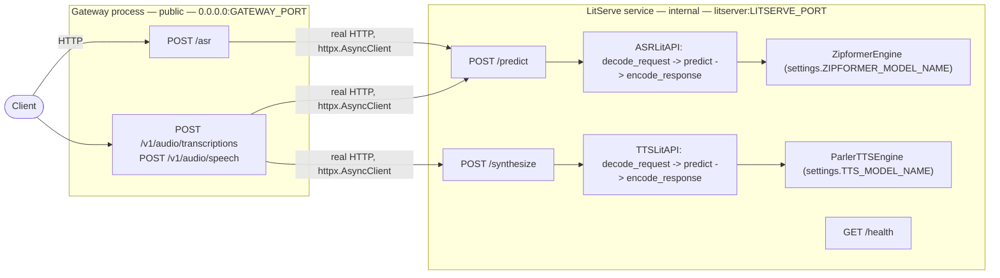

# EC ASR & TTS Service

[](pyproject.toml)
[](https://fastapi.tiangolo.com/)
[](https://github.com/Lightning-AI/LitServe)
[](docker-compose.yml)
[](https://github.com/k2-fsa/sherpa-onnx)
[](https://huggingface.co/ai4bharat/indic-parler-tts)
[](#current-models)

Bengali speech: streaming ASR (sherpa-onnx Zipformer2) and TTS (indic-parler-tts), served with [LitServe](https://github.com/Lightning-AI/LitServe) behind a FastAPI gateway.

- One-shot file transcription, streamed live captions, and text-to-speech over REST
- A separate WebSocket service for live calls: incremental ASR and cancellable, clause-by-clause TTS
- OpenAI-compatible `/v1/audio/transcriptions` and `/v1/audio/speech` for drop-in clients
- Benchmark tool for WER/CER against labeled ground truth

<p align="center">
  <a href="#current-models">Models</a> ·
  <a href="#architecture">Architecture</a> ·
  <a href="#structure">Structure</a> ·
  <a href="#setup">Setup</a> ·
  <a href="#docker">Docker</a> ·
  <a href="#test">Test</a> ·
  <a href="#endpoints">Endpoints</a> ·
  <a href="#config">Config</a> ·
  <a href="#client-examples">Client examples</a> ·
  <a href="#evaluating-against-ground-truth">Evaluation</a>
</p>

---

## Current Models

### ASR

- **Checkpoint:** [`vosk-model-small-streaming-bn`](https://huggingface.co/alphacep/vosk-model-small-streaming-bn) — pulled from Hugging Face at load time, not hosted by this project
- **Architecture:** sherpa-onnx streaming Zipformer2 transducer (ONNX). Consumes audio as one growing stream, so there is no attention-memory blowup on long clips and no segmenting step
- **Input:** 16 kHz mono (`SAMPLE_RATE`)
- **License:** Apache-2.0 (commercial use OK)
- **Swap it:** set `ZIPFORMER_MODEL_NAME`. Checkpoints name their ONNX files differently, so a different repo also needs a `ZipformerLayout` — see [`zipformer/layouts.py`](src/litserver/zipformer/layouts.py), which ships `VOSK_BN` and `K2_FSA`. `GET /health` reports what is actually loaded

**Why this one, and only this one**

This is the only ASR engine in the repo. It decodes **incrementally**, which is
what a live call needs: one stream stays open across frames, and sherpa-onnx's
endpoint rules say when the caller stopped talking. Whole-utterance engines
cannot do either, so NeMo Conformer, Wav2Vec2 and Whisper were removed along
with the `ENGINE` switch and `MAX_SEGMENT_SECONDS` that existed to serve them.

**Inference notes**

- **Runs on GPU by default** (`ZIPFORMER_PROVIDER=cuda`). That is an onnxruntime execution provider, independent of `ACCELERATOR`: it is a property of the installed sherpa-onnx wheel, so the `litserver` image ships the CUDA wheel from [k2-fsa's index](https://k2-fsa.github.io/sherpa/onnx/cuda.html) pinned to match its CUDA/cuDNN pair. The PyPI wheel bundles a CPU-only `libonnxruntime`, so `cuda` on *that* wheel **silently falls back to CPU** rather than failing — the engine logs a warning at load when it detects the mismatch, which onnxruntime itself would not

  **Measured** on an RTX 2050 (4GB), 24 FLEURS clips / 340s audio, GPU otherwise idle:

  | provider | batch | RTF | frame mean | frame p95 | VRAM |
  |---|---|---|---|---|---|
  | `cpu` | 7.59s | 0.0223 | 2.72 ms | 17.45 ms | — |
  | `cuda` | 3.88s | 0.0114 | 2.58 ms | 17.04 ms | 303 MiB |

  CUDA is ~1.95x on the batch `/predict` path, where `decode_streams()` runs one encoder pass across a whole batch. Per streaming frame it is only ~1.06x — noise, because the checkpoint is small enough that kernel-launch overhead rivals the compute. Neither path has a latency problem to solve: CPU already decodes a 100ms frame in 2.7ms (~37x real time). The real cost of `cuda` is the 303 MiB, on a card that may also hold the ~2.6GB TTS model.

  The wheel and the setting move together — the wheel supplies the provider, the setting selects it — so **to fall back to CPU, change both**. The wheel is a build arg on `litserver.Dockerfile`, deliberately not an `.env` setting: nothing in compose overrides it, so a rebuild has to say so explicitly.

  ```bash
  docker compose build --build-arg SHERPA_ONNX_CUDA_VERSION=cpu litserver
  # then set ZIPFORMER_PROVIDER=cpu in .env
  ```

  The same arg takes an exact local version from [k2-fsa's index](https://k2-fsa.github.io/sherpa/onnx/cuda.html) to pin a different wheel; any replacement must match the image's CUDA/cuDNN. The CUDA wheel is monolithic (no `sherpa-onnx-core` split) but does **not** bundle CUDA or cuDNN — it dlopens `libcublasLt.so.12` / `libcudnn.so.9` through the ordinary loader.

  **This is why `litserver.Dockerfile` runs `ldconfig` over the pip `nvidia-*` lib dirs.** The `pytorch/pytorch` base ships CUDA as pip wheels under `site-packages`, not as system libraries: torch resolves those itself (so TTS needs no help), but onnxruntime's CUDA provider does not, and without the `ldconfig` step loading the recognizer dies with `libcublasLt.so.12: cannot open shared object file`. Note that this failure **raises** rather than falling back to CPU — unlike the CPU-only-wheel case, it takes the ASR worker down at startup. This is also the concrete sense in which ASR and TTS share one CUDA: both land on the same CUDA 12.x / cuDNN 9 libraries
- Higher WER than the heavier alternatives — the trade for size, speed and streaming
- Hallucinated text on silence/noise is filtered by `BaseASREngine.is_non_speech` (thresholds measured on this corpus)
- Spelled-out numbers are rewritten as digits when `ITN_ENABLED` (the default) — see [`utils/itn.py`](src/utils/itn.py)

### TTS

- **Checkpoint:** [`ai4bharat/indic-parler-tts`](https://huggingface.co/ai4bharat/indic-parler-tts) (`TTS_MODEL_NAME`) — ~2.6GB in bf16, GPU-resident, pulled from Hugging Face at load time
- **Output:** mono 44.1 kHz; the gateway hands it back as base64 WAV, a playable `audio/wav` body, or raw PCM frames
- **Voices:** named voices map to Parler style prompts in [`parler/voices.py`](src/litserver/parler/voices.py); a request's `description` overrides the prompt with free-form style text
- **Long text** is split on clause boundaries at `TTS_MAX_CHARS` ([`parler/chunking.py`](src/litserver/parler/chunking.py)) and rejoined with a short pause, so a long reply doesn't hit the model as one generation.
- **The worker always streams those clauses**, as newline-delimited JSON carrying raw PCM. `POST /v1/audio/speech` with `stream=true` forwards them as they arrive, so first audio lands after the first clause instead of after the whole reply — the number that matters on a live call. Without `stream` the gateway reassembles them, and that response is byte-for-byte what the buffered path returned before, so only one worker pool exists and the old contract is unchanged. Streaming requires `response_format="pcm"`: a WAV header declares a total length nothing knows until the last clause is done.

  **Measured** on an RTX 2050 (4GB), bf16, a three-clause Bengali request, median of 3:

  | | time to first audio | total | RTF |
  |---|---|---|---|
  | buffered (before) | 10.30s | 10.30s | 1.497 |
  | streamed | **3.88s** | 10.30s | 1.497 |

  Streaming does not make generation faster — it makes the caller wait 2.7x less for the first sound. Note `RTF 1.497`: on this GPU the model generates *slower than playback*, so a client that starts playing immediately will underrun mid-utterance. Buffer before playback, or use a larger GPU.

- **`torch.compile` with a static KV cache was tried and rejected.** It looks like the obvious win — batch-1 autoregressive decoding is dominated by per-step overhead — but on this stack it is measurably worse: 5.99s to first audio and RTF 1.878, against 3.88s and 1.497 without it, plus a 58.8s penalty on the first request. Clause lengths vary, so every clause is a new shape and the graph retraces, exactly as [`modeling_parler_tts.py:1666`](https://github.com/huggingface/parler-tts) warns. It also cannot run unpatched: parler-tts 0.2.2 reads `StaticCache.max_batch_size`, which transformers 4.46.1 renamed to `batch_size`, so the *second* generation onward raises `AttributeError`. Do not re-add it without re-measuring.
- **`TTS_ATTN_IMPLEMENTATION` defaults to `auto`, which passes nothing.** That is not the same as passing a default: the checkpoint is three stacked models and transformers picks per submodule. Forcing one value applies it to all, and the T5 text encoder has no SDPA kernel in transformers 4.46 — a blanket `sdpa` fails the whole worker at load with `T5EncoderModel does not support ... scaled_dot_product_attention`.
- **Repeat text is answered from a cache in the gateway**, never by the model ([`tts/cache.py`](src/api/v1/tts/cache.py)). Generation is autoregressive and costs a worker slot for seconds, while real TTS traffic is mostly repeats — prompts, confirmations, error messages — so the same sentence twice is a GPU call the service should not make. Entries are keyed on `(input, voice, description)` and hold the per-clause PCM the worker streamed, so one entry serves `stream=true`, `stream=false`, `wav` and `pcm` alike; `response_format` and `stream` are rendering decisions, not part of the key. Responses carry `X-Cache: HIT` or `MISS`, which is the only way a caller timing the endpoint can tell a fast model from a cache hit.

  Bounded by total audio (`TTS_CACHE_MAX_MB`, default 1024 ≈ 3.4 hours) rather than entry count, because replies range from ~50 KB to tens of MB; the coldest entry is evicted first. It is per-process and unreplicated, so a restart or a second gateway replica just means more misses — a latency optimization, never a correctness guarantee. Two things follow from it being a replay: generation samples, so a hit returns the one recording that was cached rather than a fresh take, which makes repeats consistent as well as instant; and a stream a client abandons mid-reply is not stored, so nobody is served truncated audio. `TTS_CACHE_ENABLED=false` synthesizes every request.
- **Turn it off** with `TTS_ENABLED=false` — worth doing whenever the GPU can't hold both checkpoints

---

## Architecture

Three independent services, separate processes and containers:

| Service | File | Role |
|---|---|---|
| **LitServe model server** | `run_litserve.py` | Holds the models, GPU-bound. Binds `0.0.0.0:LITSERVE_PORT` (default `8000`), internal only — no host port is published. Two LitAPIs share the process: ASR on `/predict`, TTS on `/synthesize`. |
| **Gateway** | `main.py` | Pure FastAPI, no model loaded. Public entrypoint, binds `0.0.0.0:GATEWAY_PORT` (default `8000`). Reaches LitServe over real HTTP at `LITSERVE_BASE_URL` (default `http://litserver:8000`). |

`litserver` resolves via Docker Compose's internal DNS (`asr-net` network), and `gateway` waits on `litserver`'s healthcheck before starting. Split the two across hosts and the gateway only needs `LITSERVE_BASE_URL` pointed at the new address.


```mermaid
flowchart LR
    Client(["Client"])

    subgraph Gateway["Gateway process — public — 0.0.0.0:GATEWAY_PORT"]
        Asr["POST /asr"]
        OpenAI["POST /v1/audio/transcriptions<br/>POST /v1/audio/speech"]
    end

    subgraph LitServe["LitServe service — internal — litserver:LITSERVE_PORT"]
        Predict["POST /predict"]
        LitAPI["ASRLitAPI: decode_request -> predict -> encode_response"]
        Engine["ZipformerEngine (settings.ZIPFORMER_MODEL_NAME)"]
        Synth["POST /synthesize"]
        TtsAPI["TTSLitAPI: decode_request -> predict -> encode_response"]
        TtsEngine["ParlerTTSEngine (settings.TTS_MODEL_NAME)"]
        Health["GET /health"]
    end

    Client -->|HTTP| Asr
    Client --> OpenAI

    Asr -->|real HTTP, httpx.AsyncClient| Predict
    OpenAI -->|real HTTP, httpx.AsyncClient| Predict
    OpenAI -->|real HTTP, httpx.AsyncClient| Synth
    Predict --> LitAPI --> Engine
    Synth --> TtsAPI --> TtsEngine
```

<details>
<summary>Why TTS shares the LitServe process instead of getting its own service</summary>

`ls.LitServer` accepts a list of `LitAPI`s, each with its own `api_path` and its
own worker processes — so ASR and TTS never contend for one request loop, and
there is no second container, second port or second healthcheck to operate.

The cost is that `ACCELERATOR` / `DEVICES` / `WORKERS_PER_DEVICE` are
server-level: both checkpoints are resident on the same GPU, and each is loaded
`WORKERS_PER_DEVICE` times. `indic-parler-tts` is ~2.6GB in bf16, against
~303 MiB for the ASR checkpoint under onnxruntime. If that doesn't fit, set `TTS_ENABLED=false` (the TTS
routes stay mounted on the gateway and answer `503`) or split it into its own
service.

</details>

<details>
<summary><code>/predict</code> is internal-only — details</summary>

`POST /predict` (LitServe's own raw JSON inference route) only runs on the internal LitServe port; it is not proxied through the gateway. Externally, use `POST /asr` or `POST /v1/audio/transcriptions` — both take a multipart upload and forward it to `/predict` for you. Need raw base64-JSON access from outside the container? Either open the internal port at your own risk or add a passthrough route to the gateway.

</details>

---

## Structure

```
.
├── main.py                        # entrypoint — gateway service (pure FastAPI, no model)
├── run_litserve.py                # entrypoint — LitServe model server service
├── fastapi.Dockerfile             # lightweight image for the gateway (no ML deps)
├── litserver.Dockerfile           # heavy image for the model server (GPU, torch)
├── src/
│   ├── core/
│   │   ├── config.py              # env-driven settings (no prefix)
│   │   └── logging.py             # loguru sinks
│   ├── litserver/                 # one package per model, plus the shared contracts
│   │   ├── base.py                # BaseEngine + BaseASREngine/BaseTTSEngine + Audio
│   │   ├── litapi.py              # ASRLitAPI (/predict) and TTSLitAPI (/synthesize)
│   │   ├── server.py              # builds the LitServer instance (both APIs)
│   │   ├── zipformer/             # the ASR engine
│   │   │   ├── engine.py          # streaming Zipformer2 + ZipformerSession + build()
│   │   │   └── layouts.py         # per-checkpoint Hub repo layouts
│   │   └── parler/
│   │       ├── engine.py          # indic-parler-tts load + synthesize + build()
│   │       ├── chunking.py        # split text into speakable clauses
│   │       └── voices.py          # voice -> style-prompt table (no heavy imports)
│   ├── utils/
│   │   ├── audio.py               # base64 -> waveform decode/resample, WAV framing
│   │   └── itn.py                 # spelled-out Bengali numbers -> digits
│   └── api/
│       ├── client.py              # gateway -> LitServe HTTP client (shared by every router)
│       └── v1/
│           ├── asr/router.py      # POST /asr and /v1/audio/transcriptions
│           ├── asr/schema.py      # request/response models
│           ├── tts/router.py      # POST /v1/audio/speech
│           ├── tts/cache.py       # replay already-synthesized speech, keyed by text+voice
│           └── tts/schema.py      # request/response models
├── tests/test_api.py              # unit tests (models mocked)
└── scripts/
    ├── benchmark.py                # WER/CER + latency eval against ground truth (requires it)
    └── download_eval_data.py       # fetch a small labeled Bengali ASR benchmark (ground truth)
```

---

## Setup

```bash
python -m venv .venv && source .venv/bin/activate
pip install -e .
cp .env.example .env
```

- `pip install -e .` alone installs only the gateway's dependencies (fastapi/httpx/uvicorn — no ML stack). That is enough to run `main.py` against a model server running elsewhere.
- To run the model server locally, install the `serve` extra: `pip install -e ".[serve]"` — it pulls torch, litserve, librosa, sherpa-onnx and `parler-tts` from git (several minutes, several GB).
- **Python version:** fixed at 3.12 (`requires-python = "==3.12.*"`) across both images — the gateway (`python:3.12-slim`) and the LitServe/GPU image (`pytorch/pytorch:2.10.0-cuda12.8-cudnn9-runtime`).

---

## Docker

```bash
docker compose up --build
```

Three services, from two Dockerfiles:

| Service | Dockerfile | Published port | Notes |
|---|---|---|---|
| `litserver` | `litserver.Dockerfile` | none (internal) | CUDA/PyTorch base, GPU-bound, several GB |
| `gateway` | `fastapi.Dockerfile` | `GATEWAY_PORT` (8000) | `python:3.12-slim`, no ML deps — small, fast to build/deploy/scale independently |

- `gateway` won't accept traffic until `litserver`'s healthcheck (`GET /health`) passes — no manual readiness polling needed. First request otherwise pays the checkpoint download; the `hf-cache` volume keeps it across restarts and shares it between `litserver` (`HF_HOME=/opt/cache/huggingface`).
- GPU is on by default (`ACCELERATOR=cuda`, requires `nvidia-container-toolkit`). For CPU-only: remove the `deploy.resources` blocks from `litserver` in `docker-compose.yml`, set `ACCELERATOR=cpu`, and — because ASR runs under onnxruntime rather than torch — set `ZIPFORMER_PROVIDER=cpu` and rebuild with `--build-arg SHERPA_ONNX_CUDA_VERSION=cpu` as well. `ACCELERATOR` alone does not move ASR off the GPU.

Run one service on its own with `docker compose up gateway litserver`.

---

## Test

```bash
pip install -e ".[dev,serve]"
pytest -q
```

`serve` is required alongside `dev` because the tests exercise `ZipformerEngine`, and `ASRLitAPI`/`TTSLitAPI` directly (models mocked), and importing those pulls in `numpy`, `sherpa-onnx`, `litserve` and `parler-tts`. The whole file fails to collect if any of them is missing — `parler-tts` installs from git and is the one most often absent. No checkpoint is downloaded and no GPU is needed.

---

## Endpoints

**Gateway** (`main.py`, public on `GATEWAY_PORT`):

All routes sit at the root, so a client reaches them by base URL alone.

| | |
|---|---|
| `POST /v1/audio/transcriptions` | OpenAI-compatible transcription: multipart audio in, `{"text": …}` out (segments joined into one utterance) |
| `POST /v1/audio/speech` | OpenAI-compatible speech: `{input, voice, response_format, stream}` in, raw `wav`/`pcm` out (`pcm` strips the WAV header for telephony; `stream=true` sends each clause as it is synthesized and requires `pcm`). Text already synthesized for the same voice and description is replayed from cache — `X-Cache: HIT`/`MISS` says which |
| `POST /asr` | multipart upload returning `{taskType, output: [{source}], time_taken}` — the existing contract, and what the chatbot UI posts to through Caddy's `/asr*` proxy. Extra form fields such as `model_type` are ignored |
| `GET /health` | gateway liveness — loads no model, so it answers while the model server is still warming up. Also reports `tts_cache` counters (hits, misses, evictions, MiB used), which is how `TTS_CACHE_MAX_MB` gets sized from data rather than guessed |
| `GET /docs` | Swagger UI |

**LitServe** (`run_litserve.py`, internal only — no host port published):

| | |
|---|---|
| `POST /predict` | raw JSON inference |
| `POST /synthesize` | raw JSON synthesis |
| `GET /health` | LitServe healthcheck, what `gateway`'s `depends_on` waits for |

<details>
<summary>Inference request / response payloads</summary>

Request (internal `/predict`, and what `POST /asr` builds internally):

```json
{
  "config": {
    "language": {"sourceLanguage": "bn"},
    "samplingRate": 16000
  },
  "audio": [
    {"audioContent": "<base64-encoded wav/flac/ogg/mp3>"}
  ]
}
```

Response:

```json
{
  "taskType": "asr",
  "output": [{"source": "transcribed bengali text"}],
  "time_taken": 0.42
}
```

TTS request (`POST /v1/audio/speech`, and internal `/synthesize`):

```json
{
  "input": "আমি বাংলায় কথা বলি।",
  "voice": "Aditi",
  "description": null
}
```

`voice` is one of the names in [`parler/voices.py`](src/litserver/parler/voices.py); `description` overrides
it with free-form style text. Both are optional — omitted, the request uses
`TTS_VOICE`. Response:

```json
{
  "taskType": "tts",
  "audioContent": "<base64-encoded mono 16-bit wav>",
  "sampleRate": 44100,
  "voice": "Aditi",
  "time_taken": 1.83
}
```

</details>

---

## Config

All settings are plain env vars (no prefix), read from `.env`. See [`.env.example`](.env.example) for the annotated list and [`src/core/config.py`](src/core/config.py) for the defaults.

**Models**

- `ZIPFORMER_MODEL_NAME` — the ASR checkpoint. A different repo layout also needs a `ZipformerLayout` (see [`zipformer/layouts.py`](src/litserver/zipformer/layouts.py)).
- `ZIPFORMER_PROVIDER` — onnxruntime execution provider, `cuda` (default) or `cpu`. Independent of `ACCELERATOR`; needs a matching wheel (see [Current Models](#current-models)).
- `TTS_ENABLED` — **on by default.** Mounts the TTS LitAPI alongside ASR in the same LitServe process; it costs a second checkpoint's VRAM per worker (~2.6GB in bf16). Set `false` on a box whose GPU can't hold both: ASR then needs no GPU at all and `POST /v1/audio/speech` answers `503`.
- `TTS_MODEL_NAME` / `TTS_VOICE` / `TTS_MAX_CHARS` — the TTS checkpoint, the voice used when a request names none, and the clause length text is split at before synthesis.
- `TTS_ATTN_IMPLEMENTATION` — `auto` (default, per-submodule), `eager`, or `sdpa`. See the TTS notes above before changing it; `sdpa` breaks this checkpoint's text encoder.
- `TTS_CACHE_ENABLED` / `TTS_CACHE_MAX_MB` — whether the gateway replays already-synthesized speech instead of calling the model, and how much audio it keeps to do so, in MiB (default on, 1024 ≈ 3,000 four-second prompts). It is a ceiling, not an allocation — the gateway grows into it only as distinct text arrives. See the TTS notes above.

  **Sizing it:** `GET /health` reports `tts_cache`. Raise `TTS_CACHE_MAX_MB` when `evictions` is climbing — that is the working set not fitting. A poor hit rate with *zero* evictions means the text itself rarely repeats, which no cap fixes. The cap is per gateway **process**, so N uvicorn workers or N replicas hold N caches; budget the container limit accordingly.
- `ITN_ENABLED` — rewrite spelled-out Bengali numbers as digits. On by default; measured worth ~1.7 WER points on FLEURS.

**Serving**

- `ACCELERATOR` / `DEVICES` / `WORKERS_PER_DEVICE` — LitServe placement and worker count, the actual concurrency lever for inference throughput. Server-level, so ASR and TTS share them.
- `TRANSCRIBE_BATCH_SIZE` — utterances batched per engine call.
- `LITSERVE_TIMEOUT` — how long a request may sit in LitServe's queue before a `504`. Raised well above LitServe's own 30s default because Parler generation is slow enough to queue past it with nothing wrong.

**Networking**

- `GATEWAY_PORT` / `LITSERVE_PORT` — each service's own port; both bind `0.0.0.0`. Only the gateway port is published to the host.
- `LITSERVE_BASE_URL` — where the gateway reaches the model server. Defaults to the compose service name (`http://litserver:8000`), which resolves only inside that network; set it explicitly when the two run apart, and keep it in step with `LITSERVE_PORT`.
- `CORS_ALLOW_ORIGINS` — comma-separated origins allowed to call the gateway cross-origin, so a browser UI can hit `/asr` and `/v1/audio/speech` directly instead of proxying.

---

## Client examples

```bash
# transcribe a file through the gateway
curl -F file=@path/to/audio.wav http://localhost:8000/asr

# the same thing, OpenAI-style
curl -F file=@path/to/audio.wav http://localhost:8000/v1/audio/transcriptions

# synthesize speech to a playable file
curl -X POST http://localhost:8000/v1/audio/speech \
    -H 'content-type: application/json' \
    -d '{"input": "আমি বাংলায় কথা বলি।", "voice": "Aditi"}' \
    -o out.wav

```

---

## Evaluating against ground truth

`scripts/benchmark.py` computes WER/CER for any ASR HTTP endpoint sharing this pipeline's request/response contract, measured against labeled ground truth.

```bash
pip install ".[eval]"
python scripts/download_eval_data.py --data-dir data/eval_fleurs_bn
python scripts/benchmark.py --api-url http://127.0.0.1:8000/predict \
    --data-dir data/eval_fleurs_bn --output-dir benchmark_output
```

Point `--api-url` at any endpoint sharing the request/response contract below — the gateway route above, LitServe's `/predict` if you reach it directly, or another service entirely.

Requests run concurrently (`--concurrency`, default 10), so the report doubles as a throughput measurement rather than a pure accuracy run. Writes two files to `--output-dir`:

- `predictions.json` — per-utterance reference, hypothesis, WER/CER, latency, any request error.
- `report.txt` — corpus-level WER/CER/MER/WIL (aggregated, not averaged) plus latency p50/p95/p99 and requests/sec at that concurrency.

<details>
<summary>Evaluation dataset details</summary>

[FLEURS](https://huggingface.co/datasets/google/fleurs) (Google's multilingual speech benchmark, 100+ languages) — read-aloud, professionally recorded sentences from the FLoRes machine-translation dataset, so content is naturally-worded but not spontaneous/conversational. This project uses the `bn_in` (Bengali, India locale) config, license CC-BY-4.0.

`download_eval_data.py` pulls the `test` (920 utterances) and `validation` (402 utterances) splits via the `datasets` library — not `train`, which isn't held-out eval data. Audio is 16 kHz mono, 32-bit float WAV, a few seconds to ~15s long, each with a `transcription` (normalized) and `raw_transcription` (original casing/punctuation).

Output layout in `--data-dir`:

- `data.tar` — one archive member per utterance (`fleurs_bn_{split}_{position:04d}.wav`). `benchmark.py` reads audio straight out of it via `tarfile`, no extraction step.
- `ground_truth.json` — tar member name → `{transcription, raw_transcription}`, merged across both splits.

Member names are the loop position, not FLEURS' own `id` field — `id` is **not unique within a split** (`validation` has 402 rows but only 150 distinct ids, which would silently overwrite 252 files if used as the filename).

</details>
